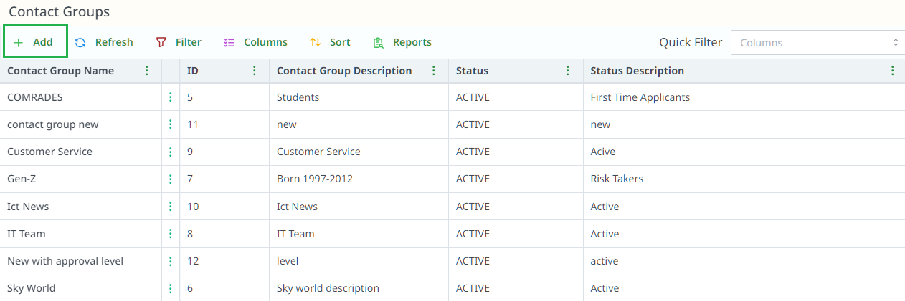
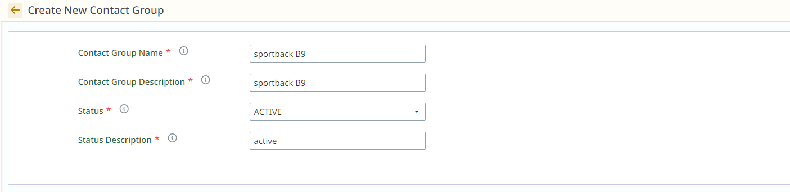

# Contact Groups

## Overview

## How to Create a New Contact Group

1. **Click on "+ Add"** to create a new contact group.

2. After clicking, fill in the details:

- **Contact Group Name**: Enter the name of the contact group.
- **Contact Group Description**: Provide a description for the group.
- **Status**: Choose the status (Active/Inactive).
- **Status Description**: Add any additional details about the status (e.g., "Active", "Inactive").

3. Click **Save** to create the new contact group.

