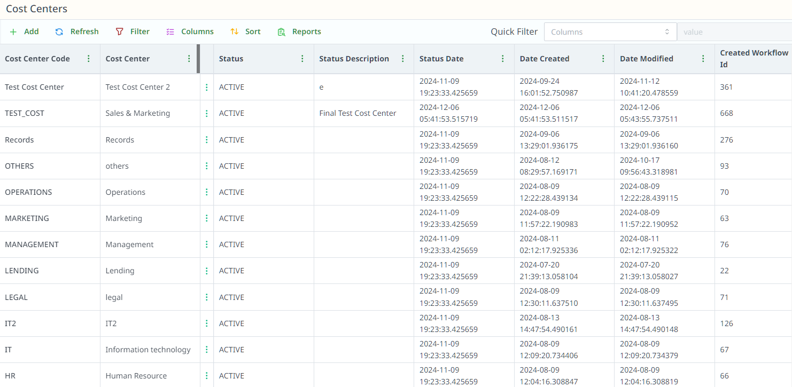
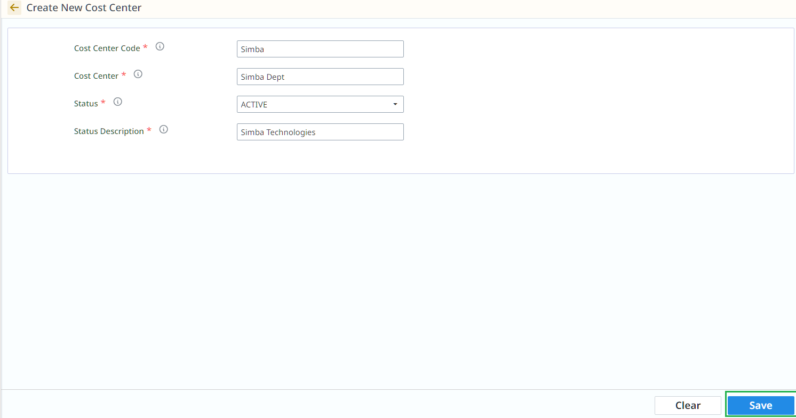
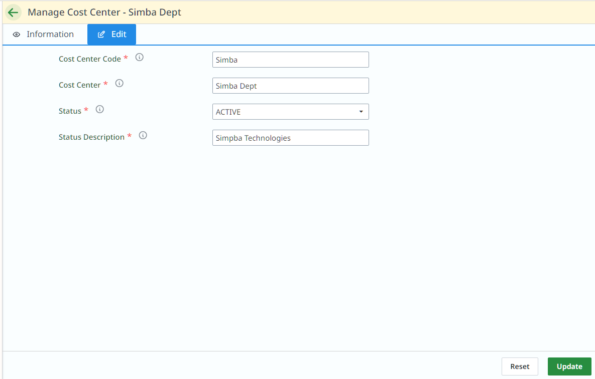

# Cost Center

## Overview

## How to Create a Cost Center

1. **Click on + Add** to start.

### Fill in the Fields:

- **Cost Center Code**: Unique ID for the cost center.
- **Cost Center Name**: Name (e.g., "Marketing", "HR").
- **Status**: Choose between Active or Inactive.
- **Status Description**: Add any extra details (e.g., "Active").

Click **Save** to create the cost center.

## How to Edit a Cost Center

1. **Find the Cost Center** you want to edit.
2. **Double-click** it or click the **three-dot menu**.
3. Choose **"Edit"**.

4. Change the details (Code, Status, Description).

Click **Update** to update.

