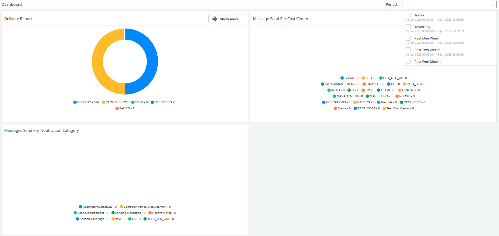

# Dashboard

The **Dashboard** provides a graphical representation of various activities and statistics related to the SMS system. It displays key performance indicators, such as message delivery status, cost center performance, and notification category usage. The dashboard allows for easy filtering by period, helping users monitor system usage and performance.

## Table of Contents

1. [Delivery Report Card](#delivery-report-card)
2. [Cost Center Card](#cost-center-card)
3. [Notification Category Card](#notification-category-card)

---

## 1. Delivery Report Card

The **Delivery Report** card gives an overview of message deliveries for the selected period. It provides key statistics, including:

- **Total Messages Sent**: The total number of messages sent during the period.
- **Messages Failed**: The number of messages that failed to be delivered.
- **Messages in Queue**: The number of messages currently in the queue.
- **Messages Delivered**: The number of messages successfully delivered to clients.
- **Messages Pending**: The number of messages waiting to be processed before entering the queue.

#### View More Details
Clicking the **View More** button provides more detailed information, including:

1**Detailed Table**: A breakdown of the message delivery data, including:

---

## 2. Cost Center Card

The **Cost Center** card provides insights into how different departments (referred to as **Cost Centers**) are using the SMS system. Each cost center is allocated a budget for sending SMS messages, and the dashboard helps monitor their usage.

### Key Features:
- **Donut Chart**: Displays the messages sent by each cost center within the selected period.
- **Budget vs. Consumption**: A comparison between the messages sent by each cost center and their allocated budget.

#### View More Details
Clicking the **View More** button opens a **Bar Chart** that compares the **message consumption** against the **allocated budget** for each cost center, helping to track budget utilization.

---

## 3. Notification Category Card

Each SMS message is categorized by its **Notification Category**, which defines the purpose of the message. These categories might include campaign messages, alerts, or other types of notifications.

### Key Features:
- **Message Distribution**: Helps identify which notification categories (e.g., campaigns, alerts) generated the most messages during the selected period.

---

## Conclusion

The **Dashboard** is a powerful tool for monitoring and analyzing message delivery, cost center performance, and notification category usage. By using the donut charts, bar charts, and detailed tables, users can quickly gain insights into system activity, track budgets, and assess performance. The ability to filter by period makes it easy to analyze trends over time and optimize system usage.
