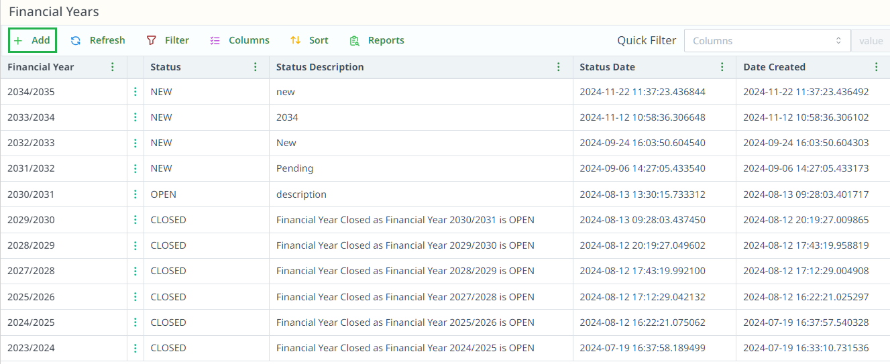
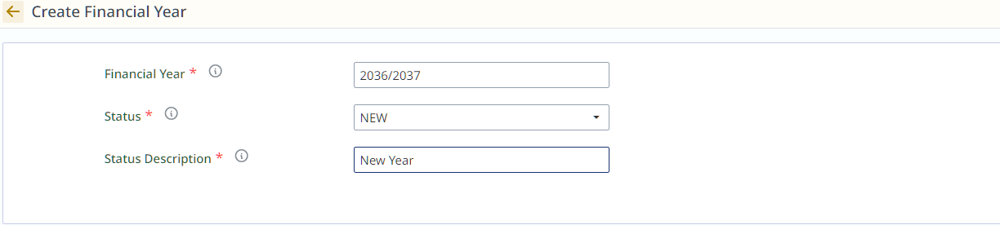
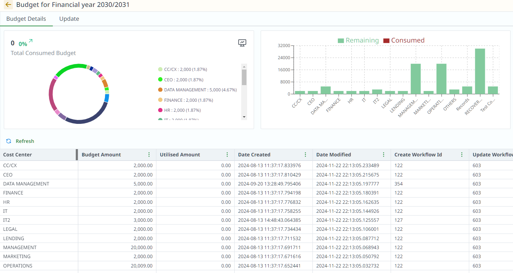

# Financial Years

## Overview

## How to Create a New Financial Year

1. **Click on "+ Add"** to create a new financial year.

2. Fill in the details:

- **Financial Year**: Enter the year (e.g., "2024-2025").
- **Status**: Select the status (New/Open/Closed).
- **Status Description**: Add any additional details (e.g., "Active", "Closed").
:::tip
Only one year can be open at a time.
If a financial year is set to "Open," any other open year will be closed automatically.
:::

3. Click **Save** to create the new financial year.

##  Budget Allocation

### Manage Budget Allocation:

- Budget can be allocated to each cost center.
- You can assign or update the budget for each cost center.
