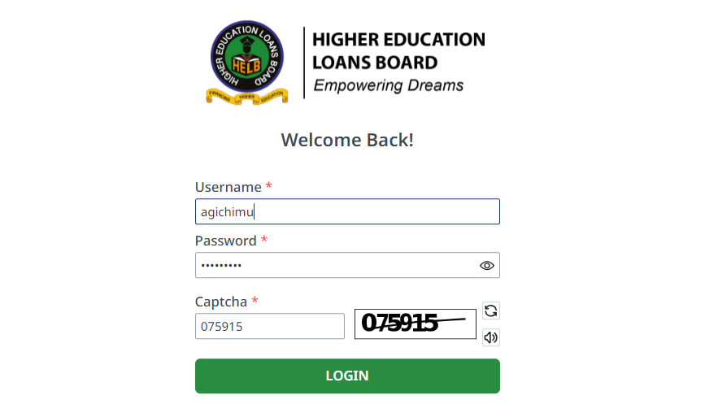
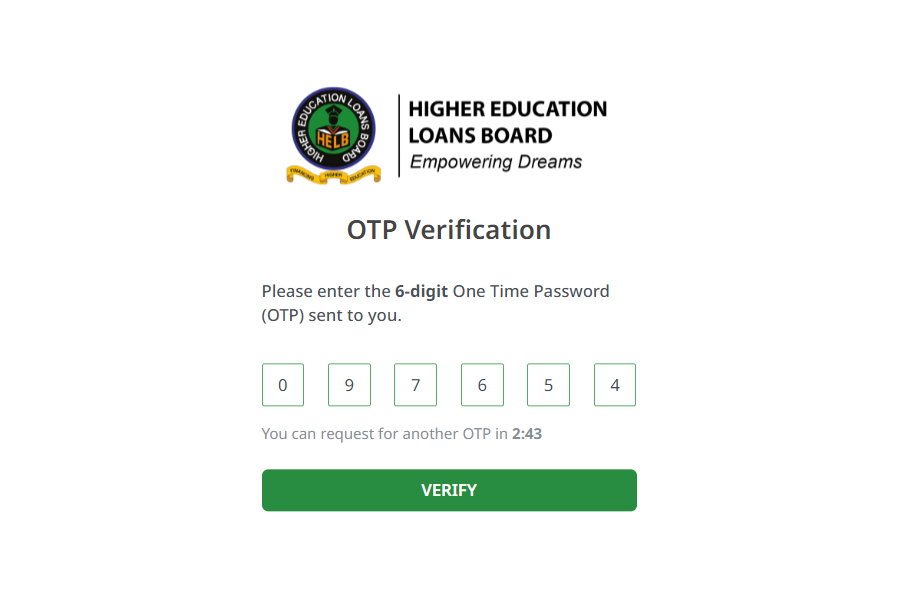
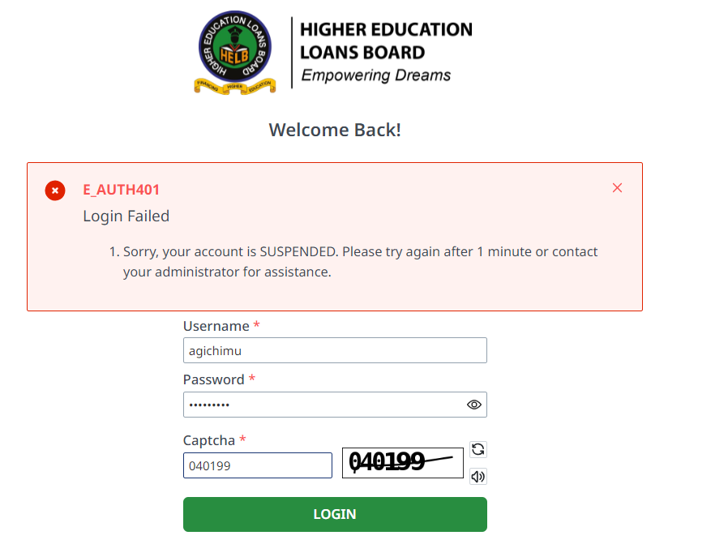

# First Time Login

### Step 1: Logging in

1. Go to [Helb Communications Portal - Client Portal](https://helbcommunicationportal.co.ke)

    

2. Enter your AD username and password 

3. Enter the captcha value you see on the textbox to the right.

4. Click on the **Login** button.

### Step 2: One Time Password (OTP) Verification

1. After clicking **Login**, an OTP will be sent to your phone.

   

:::tip
If you don't receive the OTP, click Request for OTP.
:::
1. If you enter wrong credentials 4 times, your account will be suspended.

   

