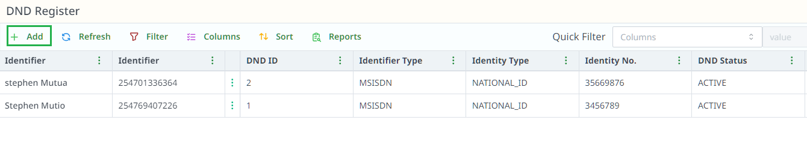

# Survey DND Register

## Overview

## How to Add a Single Survey DND Contact

1. **Click on "+ Add"** to begin adding a new survey-specific DND contact.

2. **Single Survey DND**: To add a single contact to the Survey DND register, fill in the following fields:

    - **Identifier Type**: Specify the type of identifier (e.g., Phone Number, Email).
    - **Identity**: Enter the identifier value (e.g., the phone number or email).
    - **DND Status**: Choose whether the contact is active or inactive in the DND register.
    - **Notification Category**: Select the category for notifications (e.g., survey invitations, follow-ups).
    - **DND Reason**: Add the reason why the contact is placed in the Survey DND register (e.g., "Declined Surveys", "Requested No Survey Communication").

3. Click **Save** to add the contact to the Survey DND register.

## How to Import Survey DND Contacts in Bulk

1. **Bulk Survey DND Import**: To import multiple contacts into the Survey DND register:
    - Download and use the provided template designed specifically for survey-related DND contacts.
    - Input the relevant information for each contact into the template.
    - Upload the filled template to add multiple contacts in bulk.

## Updating the Survey DND Register

- You can also **update the Survey DND status** of contacts directly from the contact list. To do so:
    - Navigate to the **Survey Contact List**.
    - Find the contact and update their Survey DND information.
