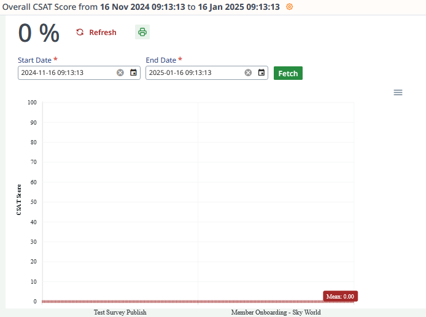
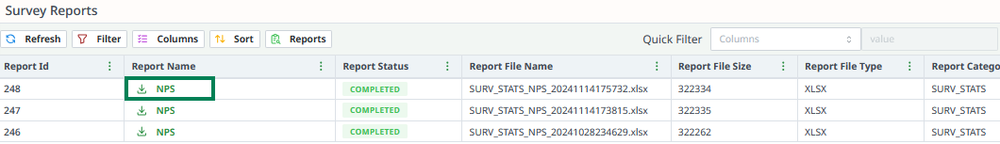

# Survey Reports

The **Survey Reports** section provides access to two key reports:
1. **Survey Report**
2. **Survey CSAT Report**

These reports help analyze survey performance, responses, and customer satisfaction.

---

## Accessing Survey Reports

1. **Navigate to Survey Reports**:
    - Go to the **Survey** section in the sidebar or top bar.
    - Locate the **Survey Report** and **Survey CSAT Report** options.

2. **Select the Desired Report**:
    - Click on **Survey Report** or **Survey CSAT Report** to view or generate the respective report.

---

## Types of Survey Reports

### 1. Survey Report
The **Survey Report** provides detailed insights into survey performance, including:
- Total responses received.
- Completion rates.
- Individual question performance metrics.

### 2. Survey CSAT Report
The **Survey CSAT Report** focuses on **Customer Satisfaction** (CSAT) scores and includes:
- Average CSAT score for the survey.
- Detailed breakdown of satisfaction levels across responses.
- Trends in customer satisfaction over time.

---

## Downloading Survey Reports

1. **Access the Reports List**:
    - Go to the **Reports** section to view all generated reports.

2. **Download the Survey Report**:
    - Locate the **Survey Report** or **Survey CSAT Report** in the list.
    - Click the **Download** button to download it as an Excel file.

---

These reports enable effective survey management and provide actionable insights into survey performance and customer satisfaction.
