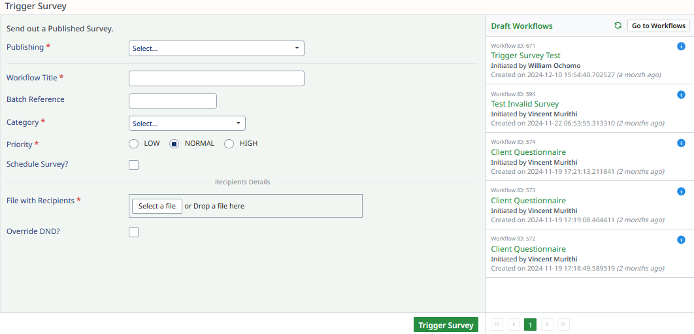

# Triggering a Survey

This section provides a step-by-step guide for triggering a survey workflow.

---

## How to Trigger a Survey

Follow these steps to initiate a survey:

### Step 1: Navigate to **Trigger Survey**
- Access the **Trigger Survey** section in the portal.

### Step 2: Fill in the Required Details

Provide the necessary information to set up the survey trigger:

- **Publishing***: Select the survey to be triggered (mandatory field).
- **Workflow Title***: Enter a title for the triggering workflow (mandatory field).
- **Batch Reference**: Provide a reference identifier for the batch (optional).
- **Category***: Choose a category for the survey (mandatory field).
- **Priority***: Set the priority level:
  - **High**
  - **Medium**
  - **Low**
- **Schedule Survey?**: Enable or disable the survey scheduling feature.

### Step 3: Add Recipient Details

Define the recipients for the survey:

- **File with Recipients***: Upload a file containing recipient details or drag and drop the file (mandatory field).
- **Override DND?**: Specify whether to bypass DND (Do Not Disturb) restrictions.

### Step 4: Submit the Survey Trigger
- Click **Trigger Survey** to trigger the survey.

---
