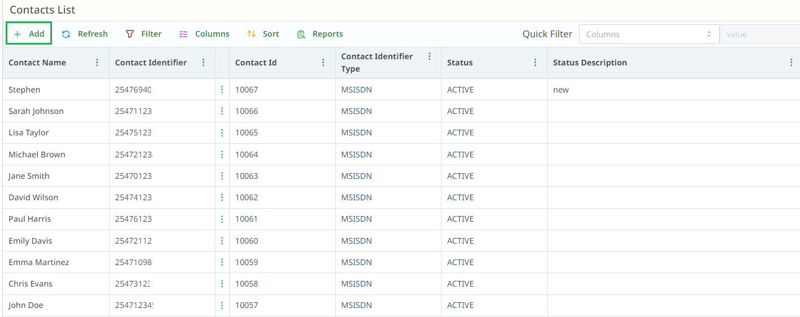
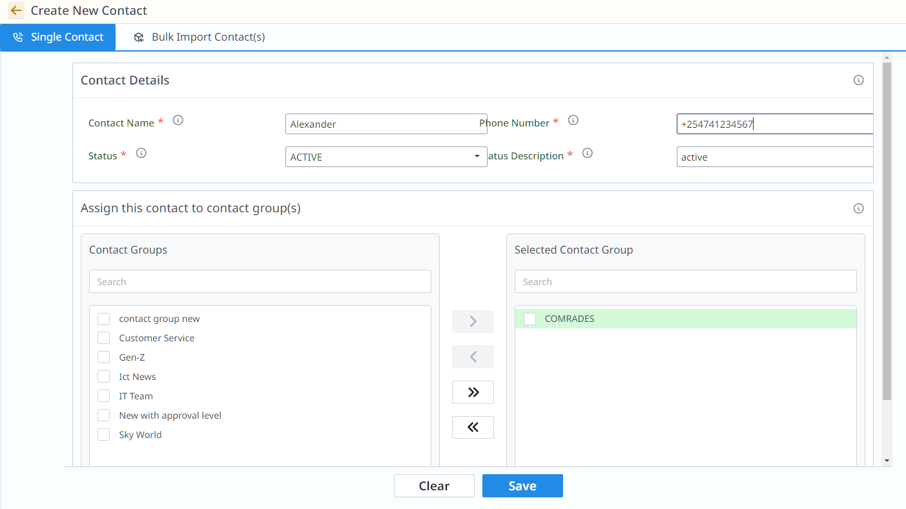

# Contacts

## Overview

Under **Messaging**, click on **Contact List** to view and manage your contacts.

## How to Create a New Contact

1. **Click on "+ Add"** to create a new contact.

2. After clicking, you can choose from the following options:

   - **Single Contact Creation**: Add details for a single contact.

   

### For Single Contact Creation:
- **Contact Name**: Enter the name of the contact.
- **Phone Number**: Enter the phone number.
- **Status**: Choose either Active or Inactive.
- **Status Description**: Add a description for the status (e.g., "Active", "Inactive").
- **Assign Contact Group**: Select the contact group to assign the contact to (optional).

   - **Bulk Import Contacts**: Import multiple contacts via a CSV file or use a template.

   - **Edit and Delete Contacts**: Edit, remove contacts from groups, or delete contacts individually or in bulk.

3. Click **Save** to create the contact.
## Bulk Contact Import

To import multiple contacts:

1. **Download the Bulk Template file** from the portal.
2. Fill in the template fields:
    - **Workflow Name**
    - **Contacts File**
    - **Workflow Description**
3. **Upload the completed file** back to the portal.

4. Submit the workflow for processing.

After import, the process moves to the **Draft Workflow**, where you are presented with a list of:
- Valid Contacts
- Invalid Contacts
- Linked Stale Contacts
- Linked Contacts

From this stage, you can:
- Proceed to complete the workflow if there is no approval level.
- Move to the approval level after processing valid and linked stale contacts.
