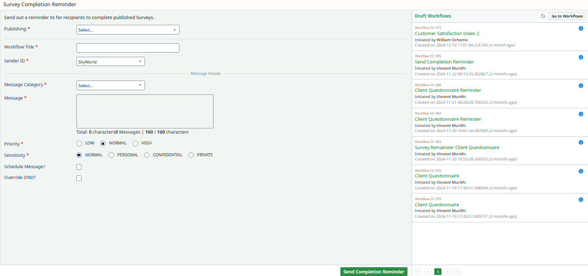

# Sending Completion Reminders

This section explains how to send reminders for survey completion to encourage participants to complete the survey.

---

## How to Send a Completion Reminder

Follow these steps to send a reminder:

### Step 1: Navigate to **Send Completion Reminder**
- Access the **Send Completion Reminder** section in the portal.

### Step 2: Fill in the Required Details

Provide the necessary information for the reminder:

- **Publishing***: Select the survey to remind about (mandatory field).
- **Workflow Title***: Enter a title for the workflow (mandatory field).
- **Sender ID***: Specify the sender's ID (mandatory field).

### Step 3: Provide Message Details

Define the content and context of the reminder:

- **Message Category***: Choose the category for the message (mandatory field).
- **Message***: Enter the content of the reminder (mandatory field).

### Step 4: Set Priority and Sensitivity

- **Priority***: Set the priority level of the message:
  - **High**
  - **Medium**
  - **Low**
- **Sensitivity***: Specify the sensitivity level of the message:
  - **Confidential**
  - **Public**

### Step 5: Schedule or Send the Reminder

- **Schedule Message?**: Enable or disable scheduling for the reminder.

### Step 6: Save and Send
- Click **Send Completion Reminder** to finalize the setup and send the reminder.

---

This process ensures timely follow-ups, increasing the likelihood of survey completion by participants.
