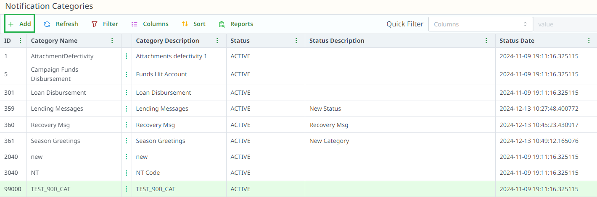
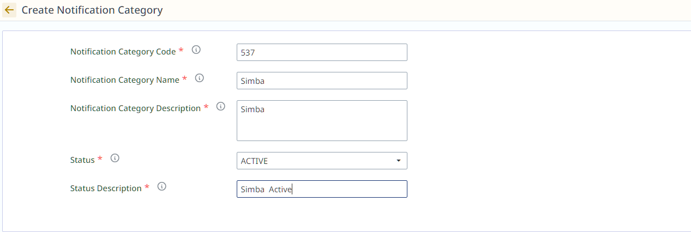

# Survey Notification Categories

## Overview of Survey Notification Categories

The Survey Notification Categories section helps you organize and manage different types of survey-related notifications, making it easier to control settings and apply changes across related notification types.

## Creating a New Survey Notification Category

1. **Click on "+ Add"** to create a new survey notification category.

   

2. After clicking **+ Add**, the following fields will appear for you to fill in:

   

   - **Notification Category Code**: Enter a unique code for the survey category. This will be used for internal references.

   - **Notification Category Name**: Provide a descriptive name for the survey category, such as "Survey Invitations" or "Survey Follow-ups".

   - **Notification Category Description**: Briefly describe the category, explaining its purpose and when it's used (e.g., "Notifications related to customer surveys").

   - **Status**: Choose between **Active** or **Inactive** to determine whether this category is active or not.

   - **Status Description**: Provide a short explanation of the status (e.g., "Active - Used for sending survey-related notifications" or "Inactive - Temporarily disabled").

3. **Click Save** to create the new survey notification category.

## How to Update a Survey Notification Category

1. **Locate the Survey Notification Category**:
   - Navigate to the **Survey Notification Categories List** view in the portal.
   - Find the desired Survey Notification Category by scrolling or using the search functionality.

2. **Access the Edit Interface**:
   - Double-click the Survey Notification Category's row or click the three-dot icon in the relevant cell.

3. **Edit Survey Notification Category Details**:
   - The edit interface displays two views:
      - **Survey Notification Category Details**: View the current details.
      - **Edit Survey Notification Category**: Modify fields that can be updated, such as the code, name, description, or status.

4. **Save Changes**:
   - Ensure all modifications are correct, then click **Update** to apply the changes.

---
