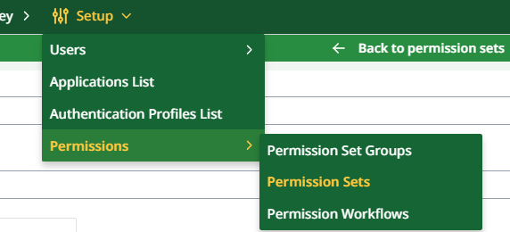
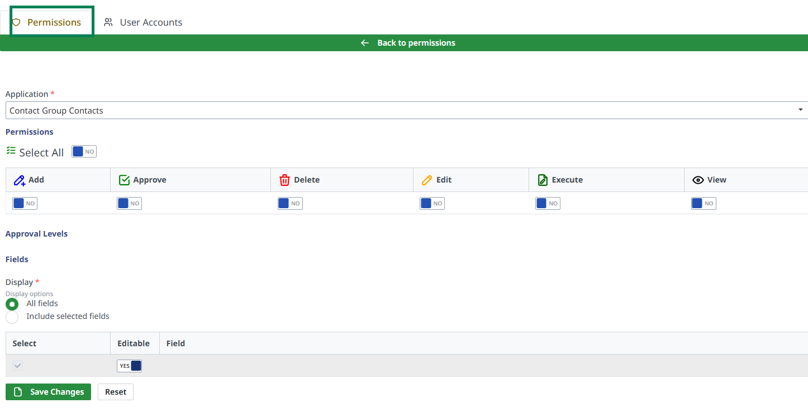
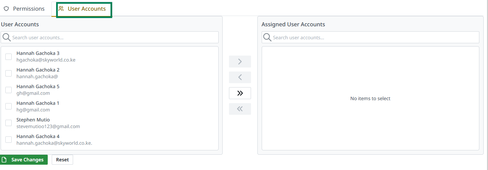

# User Permissions

This guide will walk you through the process of creating and managing Permission Sets and Permission Set Groups in your portal. A **Permission Set** defines the specific permissions required by a user to use certain features, while **Permission Set Groups** allow you to bundle multiple permission sets together for easier assignment.

## Table of Contents

1. [Accessing Permission Sets](#accessing-permission-sets)
2. [Creating a Permission Set](#creating-a-permission-set)
3. [Assigning Permissions to a Permission Set](#assigning-permissions-to-a-permission-set)
4. [Assigning a Permission Set to Users](#assigning-a-permission-set-to-users)
5. [Creating a Permission Set Group](#creating-a-permission-set-group)
6. [Editing Permission Sets and Groups](#editing-permission-sets-and-groups)

---

## 1. Accessing Permission Sets

To begin managing users' permissions:

- **From the Toolbar or Sidebar**:
  1. Navigate to **User Setup**.
  2. Click on **Permissions**. This will open a menu where you can manage **Permission Sets**, **Permission Set Groups**, and **Permissions Workflow**.

---

## 2. Creating a Permission Set

Once you're in the **Permissions** section, you can create a new permission set.

1. **Click on "Permission Sets"**: This will open a panel displaying all the already created permission sets.
2. **Add a New Permission Set**: Click **Add Permission Set** to begin creating a new set.
3. **Fill in the Required Information**:
   - **Permission Set Name**: Enter a unique name that describes the permissions.
   - **Description**: Provide a brief description of what the permission set is for.

---

## 3. Assigning Permissions to a Permission Set

After creating the permission set, you can assign specific permissions to it.

1. **Permissions Tab**:
   - Add permissions such as:
     - **Add**: Allow users to add new items or records.
     - **Approve**: Grant users the ability to approve actions.
     - **Delete**: Allow users to delete items.
     - **Edit**: Allow users to modify existing records.
     - **Execute**: Grant permission to execute specific operations.
     - **View**: Allow users to view records or data.

2. **Approval Levels**:
   - Configure different approval levels (e.g., low, medium, high).

3. **Field Access**:
   - **Display Options**: Choose which fields to display, either all fields or selected fields.
   - **Editable Fields**: Mark specific fields as editable if necessary.

---

## 4. Assigning a Permission Set to Users

Once you've created a permission set and assigned the relevant permissions, you need to assign the set to users.

1. **Choose Users for the Permission Set**:
   - In the second tab, select which users will be assigned the permission set.

---

## 5. Creating a Permission Set Group

If you want to bundle multiple permission sets for easier user management, follow these steps to create a **Permission Set Group**:

1. **Access the Permission Set Groups**:
   - From the **Permissions** section, navigate to **Permission Set Groups**.
2. **Add a New Permission Set Group**:
   - Click on **Add Permission Set Group**.
   
3. **Fill in the Group Information**:
   - **Permission Set Group Name**: Enter a name for the permission set group.
   - **Description**: Provide a description of what the group will do.
   
4. **Select Permission Sets**:
   - Choose the individual permission sets you want to include in the group.

5. **Assign Users to the Group**:
   - There’s a tab where you can select users to assign to this permission set group.

---

## 6. Editing Permission Sets and Groups

To make changes to existing permission sets or groups:

1. **Navigate to Permission Sets or Groups**:
   - Go to any of the categories (Permission Sets or Permission Set Groups) to view the list of created sets and groups.
   
2. **Select a Set or Group**:
   - Click on the permission set or group you want to edit.
   
3. **Update Information**:
   - You will see the details of the selected set or group.
   - You can update the permissions, add or remove users, and save your changes.

4. **Save Changes**:
   - Once you’ve made the necessary updates, make sure to save the changes.

---

## Conclusion

This guide provides you with the steps to efficiently manage user permissions and permission set groups within your portal. By using permission sets and groups, you can easily control user access to specific features, ensuring that each user has the appropriate permissions for their role.
